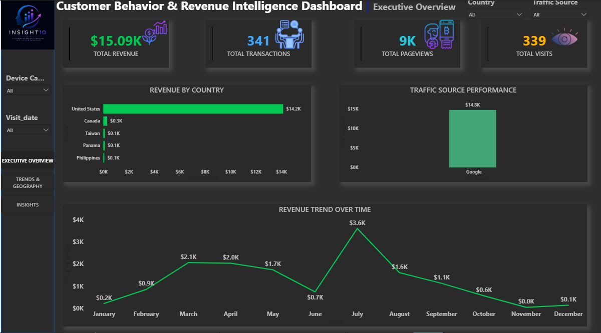
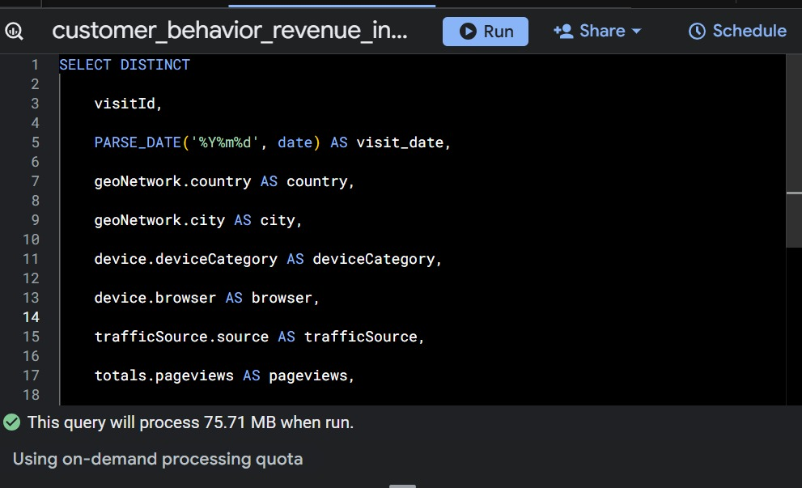
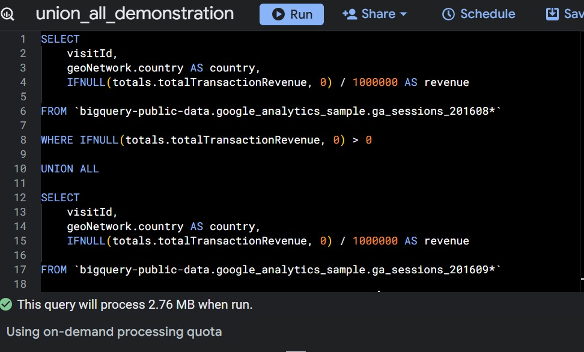
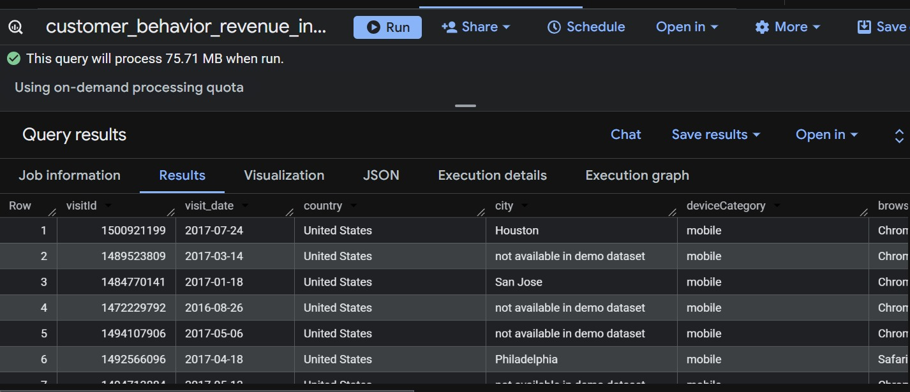
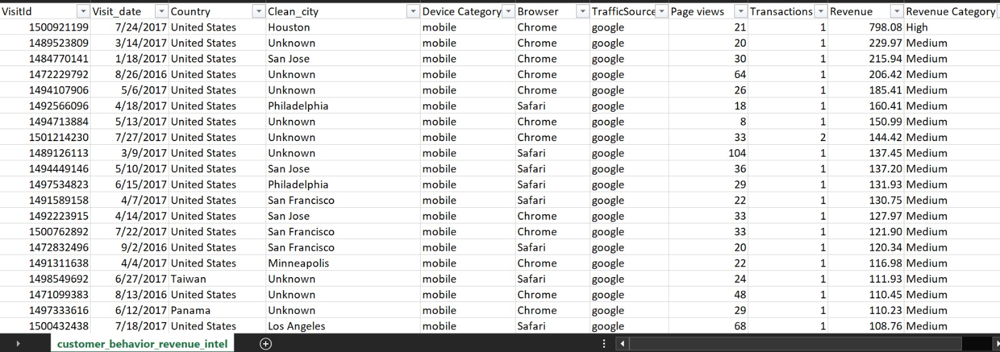

# 📊 Customer Behavior & Revenue Intelligence Dashboard

An interactive Power BI dashboard project focused on analyzing customer behavior, website traffic, device usage, geographic performance, and revenue trends using the Google Analytics Ecommerce Dataset from BigQuery.

The project combines SQL, data cleaning, Excel analysis, and Power BI visualization to generate business insights and support data-driven decision-making.

# 🌍 Dashboard Preview

# 🗄️ SQL Queries & Results

## 🔹 Main SQL Query

This query was used to extract and clean customer behavior and revenue data from BigQuery.

### SQL Concepts Used:
- SELECT
- DISTINCT
- WHERE
- ORDER BY
- LIMIT
- Aggregate Functions
- CASE WHEN

## 🔹 UNION ALL Query

This query demonstrates combining multiple BigQuery tables using UNION ALL.

## 🔹 SQL Results Preview

Sample output of the extracted dataset used for analysis and dashboard creation.

# 🧹 Data Cleaning Process

The dataset was cleaned and transformed before analysis and visualization.

### Cleaning Steps:
- Removed duplicate records
- Handled null values
- Standardized city values
- Converted revenue data types
- Filtered valid transactions
- Corrected date formats
- Prepared fields for Power BI analysis

# 📈 Dashboard Features

- KPI Cards for Revenue, Transactions, Visits & Pageviews
- Revenue Trend Analysis
- Geographic Revenue Analysis
- Traffic Source Performance
- Browser & Device Insights
- Interactive Filters & Slicers
- Modern Dark Theme Dashboard Design

# 🛠️ Tools & Technologies Used

- Power BI
- Google BigQuery
- SQL
- Microsoft Excel
- Data Cleaning & Transformation
- Data Visualization
- Business Intelligence
- Data Analysis

# 📂 Dataset

### Dataset Used:
Google Analytics Sample Ecommerce Dataset from BigQuery

The dataset contains:
- Website traffic data
- Customer behavior analytics
- Device usage information
- Transactional and revenue data
- Geographic performance insights

# 🔍 Key Business Questions Answered

- Which countries generated the highest revenue?
- Which traffic sources drove the most transactions?
- How did mobile users behave?
- What were the revenue trends across the year?
- Which browsers and cities performed best?
- How did customers interact with the website before purchasing?

# 💡 Key Business Insights

### 1. Most Revenue Came from the United States
The United States generated the highest amount of revenue compared to other countries, making it the strongest performing market.

### 2. Revenue Changed Across the Year
Revenue fluctuated across different months, with the highest revenue recorded around July, indicating seasonal purchasing behavior.

### 3. Mobile Users Were Highly Active
Most website activity and purchases came from mobile users, showing the importance of mobile commerce.

### 4. Customers Viewed Many Pages Before Purchasing
Customers explored multiple pages before completing transactions, suggesting strong product browsing behavior.

### 5. Few Transactions Generated Significant Revenue
Although the number of transactions was relatively small, they contributed a substantial amount of revenue.

### 6. Google Was the Main Traffic Source
Most customers visited the website through Google search traffic, making it the leading acquisition channel.

# 🚀 Business Recommendations

### 1. Improve the Mobile Experience
The company should optimize the mobile website to make it faster, easier to navigate, and more user-friendly since most users shop on mobile devices.

### 2. Focus on High-Revenue Countries
Marketing efforts should be increased in top-performing countries, especially the United States, to maximize revenue growth.

### 3. Take Advantage of Peak Revenue Periods
The company should increase promotions and advertising during high-performing months to maximize sales opportunities.

### 4. Strengthen Google Marketing Strategies
The business should continue improving search engine visibility and SEO performance to attract more customers from Google.

### 5. Increase Conversion Rates
Improving the checkout process and enhancing product pages can help encourage more visitors to complete purchases.

### 6. Continue Using Data Analytics
The company should continue using dashboards, analytics, and business intelligence tools to support data-driven decision-making.

# 📌 Project Outcome

This project demonstrates how business intelligence tools and data analytics techniques can be used to:
- Analyze customer behavior
- Understand revenue trends
- Evaluate traffic performance
- Support strategic business decisions
- Create interactive and visually appealing dashboards

# 📌 Author

Created by [DB-Analytics]
